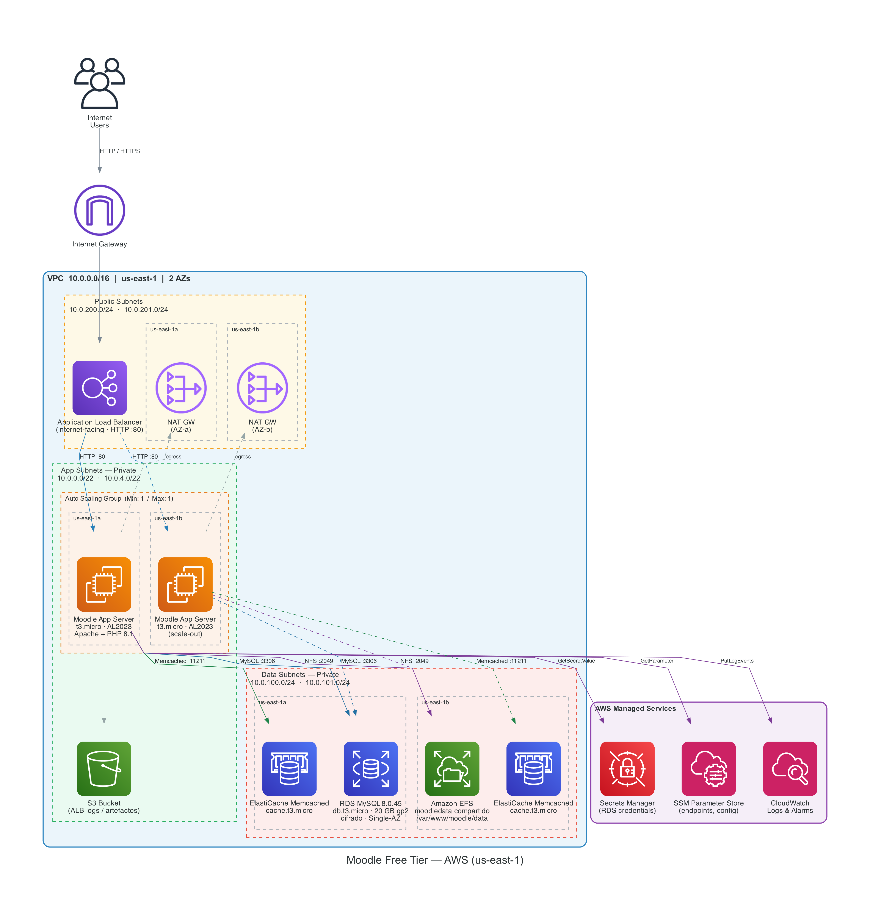

[English](#english) | [Español](#español)

---

<a name="english"></a>
# aws-refarch-moodle — Free Tier Edition

## 1. What is this repository?

This is a fork of the official AWS reference architecture for Moodle ([aws-samples/aws-refarch-moodle](https://github.com/aws-samples/aws-refarch-moodle)), **fixed to work on AWS Free Tier accounts**. Launch the CloudFormation stack, wait ~40 minutes, and Moodle 4.5 LTS is installed and ready — no manual steps required.

## 2. Why does this fork exist?

The original repo was designed for enterprise production environments. When deployed on a Free Tier account, it fails silently with cryptic errors — or no errors at all in the CloudFormation console.

The root causes discovered after 14 deployment attempts:

- **Aurora Serverless** is blocked on Free Tier (`FreeTierRestrictionError` — never shown in the CloudFormation UI)
- **ElastiCache Serverless** only supports Redis/Valkey, but the template defaults to Memcached
- **AWS CodeDeploy/CodePipeline** require a paid subscription
- **Default instance types** (`db.r6g.large`, `c7g.xlarge`) are not eligible for Free Tier
- **Moodle installation** depended entirely on CodePipeline — disabling it left an empty Apache server

## 3. Main changes

| File | What changed | Why |
|---|---|---|
| `templates/00-main.yaml` | Defaults updated for Free Tier; `DeployPipeline=false`; added Moodle admin parameters | Single entry point for all critical settings |
| `templates/03-rds.yaml` | Rewritten from Aurora (`DBCluster`) to standard RDS (`DBInstance`); MySQL `8.0.45` | Aurora is blocked on Free Tier |
| `templates/03-elasticache.yaml` | `AZMode` now conditional instead of hardcoded `cross-az` | Prevents failure when using a single AZ |
| `templates/03-rdsserverless.yaml` | Added `EngineVersion` to Aurora cluster | Was silently rejected without it |
| `templates/04-web.yaml` | Direct Moodle download; CLI auto-install; `HealthCheckGracePeriod 300s`; removed `pecl install zip` | CodePipeline removed; zip.so caused segfault on 1GB RAM |

## 4. Prerequisites

- An AWS account (Free Tier works)
- AWS CLI installed and configured (`aws configure`)
- Git

## 5. How to deploy

```bash
# 1. Clone the repo
git clone https://github.com/<your-user>/aws-refarch-moodle.git
cd aws-refarch-moodle

# 2. Create an S3 bucket and upload the templates
BUCKET="moodle-templates-$(date +%s)"
REGION="us-east-1"
aws s3 mb s3://$BUCKET --region $REGION
aws s3 cp templates/ s3://$BUCKET/templates/ --recursive --region $REGION

# 3. Launch the stack in CloudFormation (AWS Console)
#    Template URL: https://$BUCKET.s3.$REGION.amazonaws.com/templates/00-main.yaml

# 4. Get the Moodle URL once the stack is CREATE_COMPLETE (~40 min)
aws ssm get-parameter \
  --name "/Moodle/<STACK_NAME>/Network/DomainName" \
  --region $REGION --query "Parameter.Value" --output text

# 5. Before deleting the stack, empty the ALB log bucket to avoid DELETE_FAILED
aws s3 ls | grep <stack-name-lowercase>
aws s3 rm s3://<alb-log-bucket-name> --recursive --region $REGION
aws cloudformation delete-stack --stack-name <STACK_NAME> --region $REGION
```

## 6. Important parameters

Fill these in when creating the stack. Everything else has correct defaults.

| Parameter | Required value | Why |
|---|---|---|
| `DeploymentLocation` | `https://<YOUR_BUCKET>.s3.us-east-1.amazonaws.com/templates` | Points CloudFormation to your templates |
| `AvailabilityZones` | Select `us-east-1a` and `us-east-1b` | Minimum 2 AZs required by RDS and ElastiCache |
| `NotifyEmailAddress` | Your real email | Stack notifications |
| `MoodleAdminPassword` | Secure password (min 8 chars, no `$`, quotes or spaces) | Moodle admin login |
| `MoodleAdminEmail` | Your email | Moodle admin account |

**Pre-configured defaults for Free Tier (do not change):**

`DatabaseType=MySQL` · `DatabaseUseServerless=false` · `DatabaseInstanceType=db.t3.micro` · `WebInstanceType=t3.micro` · `UseServerlessSessionCache=false` · `UseServerlessApplicationCache=false` · `DeployPipeline=false` · `NumberOfAZs=2`

## 7. Architecture



The stack deploys: VPC with public/app/data subnets across 2 AZs · Standard RDS MySQL (db.t3.micro) · ElastiCache Memcached (cache.t3.micro) · EFS shared storage · Application Load Balancer · EC2 Auto Scaling Group (t3.micro) · Moodle 4.5 LTS installed automatically via CLI.

## 8. Credits

Based on the official AWS reference architecture:  
**[aws-samples/aws-refarch-moodle](https://github.com/aws-samples/aws-refarch-moodle)**  
© Amazon Web Services — Licensed under MIT-0.

This fork adds Free Tier compatibility and automated Moodle installation. See [`PROJECT-REPORT-EN.md`](PROJECT-REPORT-EN.md) for the full technical report of every change and the reasoning behind each decision.

---

<a name="español"></a>
# aws-refarch-moodle — Edición Free Tier

## 1. ¿Qué es este repositorio?

Este es un fork de la arquitectura de referencia oficial de AWS para Moodle ([aws-samples/aws-refarch-moodle](https://github.com/aws-samples/aws-refarch-moodle)), **corregido para funcionar en cuentas AWS Free Tier**. Se lanza el stack de CloudFormation, se esperan ~40 minutos, y Moodle 4.5 LTS queda instalado y listo — sin pasos manuales.

## 2. ¿Por qué existe este fork?

El repositorio original fue diseñado para entornos de producción empresarial. Al desplegarlo en una cuenta Free Tier, falla silenciosamente con errores crípticos — o sin ningún mensaje de error en la consola de CloudFormation.

Las causas raíz descubiertas tras 14 intentos de deploy:

- **Aurora Serverless** está bloqueado en Free Tier (`FreeTierRestrictionError` — nunca se muestra en la interfaz de CloudFormation)
- **ElastiCache Serverless** solo acepta Redis/Valkey, pero el template usa Memcached por defecto
- **AWS CodeDeploy/CodePipeline** requieren una suscripción de pago
- **Tipos de instancia por defecto** (`db.r6g.large`, `c7g.xlarge`) no son elegibles para Free Tier
- **La instalación de Moodle** dependía completamente de CodePipeline — al desactivarlo, el servidor mostraba solo la página por defecto de Apache

## 3. Cambios principales

| Archivo | Qué cambió | Por qué |
|---|---|---|
| `templates/00-main.yaml` | Defaults actualizados para Free Tier; `DeployPipeline=false`; parámetros de admin de Moodle agregados | Punto de entrada único para todas las configuraciones críticas |
| `templates/03-rds.yaml` | Reescrito de Aurora (`DBCluster`) a RDS estándar (`DBInstance`); MySQL `8.0.45` | Aurora está bloqueado en Free Tier |
| `templates/03-elasticache.yaml` | `AZMode` ahora condicional en lugar de `cross-az` hardcodeado | Evita fallo al usar una sola AZ |
| `templates/03-rdsserverless.yaml` | Se agregó `EngineVersion` al cluster Aurora | Era rechazado silenciosamente sin este valor |
| `templates/04-web.yaml` | Descarga directa de Moodle; auto-instalación via CLI; `HealthCheckGracePeriod 300s`; eliminado `pecl install zip` | CodePipeline eliminado; zip.so causaba segfault en 1GB de RAM |

## 4. Requisitos previos

- Una cuenta AWS (Free Tier funciona)
- AWS CLI instalado y configurado (`aws configure`)
- Git

## 5. Cómo deployar

```bash
# 1. Clonar el repositorio
git clone https://github.com/<tu-usuario>/aws-refarch-moodle.git
cd aws-refarch-moodle

# 2. Crear un bucket S3 y subir los templates
BUCKET="moodle-templates-$(date +%s)"
REGION="us-east-1"
aws s3 mb s3://$BUCKET --region $REGION
aws s3 cp templates/ s3://$BUCKET/templates/ --recursive --region $REGION

# 3. Lanzar el stack en CloudFormation (consola de AWS)
#    Template URL: https://$BUCKET.s3.$REGION.amazonaws.com/templates/00-main.yaml

# 4. Obtener la URL de Moodle cuando el stack esté en CREATE_COMPLETE (~40 min)
aws ssm get-parameter \
  --name "/Moodle/<NOMBRE_DEL_STACK>/Network/DomainName" \
  --region $REGION --query "Parameter.Value" --output text

# 5. Antes de borrar el stack, vaciar el bucket de logs del ALB para evitar DELETE_FAILED
aws s3 ls | grep <nombre-del-stack-minusculas>
aws s3 rm s3://<nombre-bucket-alb-logs> --recursive --region $REGION
aws cloudformation delete-stack --stack-name <NOMBRE_DEL_STACK> --region $REGION
```

## 6. Parámetros importantes

Completar estos al crear el stack. Todo lo demás tiene defaults correctos.

| Parámetro | Valor requerido | Por qué |
|---|---|---|
| `DeploymentLocation` | `https://<TU_BUCKET>.s3.us-east-1.amazonaws.com/templates` | Apunta CloudFormation a tus templates |
| `AvailabilityZones` | Seleccionar `us-east-1a` y `us-east-1b` | Mínimo 2 AZs requerido por RDS y ElastiCache |
| `NotifyEmailAddress` | Tu email real | Notificaciones del stack |
| `MoodleAdminPassword` | Contraseña segura (mín 8 chars, sin `$`, comillas ni espacios) | Login del admin de Moodle |
| `MoodleAdminEmail` | Tu email | Cuenta admin de Moodle |

**Defaults preconfigurados para Free Tier (no cambiar):**

`DatabaseType=MySQL` · `DatabaseUseServerless=false` · `DatabaseInstanceType=db.t3.micro` · `WebInstanceType=t3.micro` · `UseServerlessSessionCache=false` · `UseServerlessApplicationCache=false` · `DeployPipeline=false` · `NumberOfAZs=2`

## 7. Arquitectura


El stack despliega: VPC con subredes públicas, de aplicación y de datos en 2 AZs · RDS MySQL estándar (db.t3.micro) · ElastiCache Memcached (cache.t3.micro) · Almacenamiento compartido EFS · Application Load Balancer · Auto Scaling Group EC2 (t3.micro) · Moodle 4.5 LTS instalado automáticamente via CLI.

## 8. Créditos

Basado en la arquitectura de referencia oficial de AWS:  
**[aws-samples/aws-refarch-moodle](https://github.com/aws-samples/aws-refarch-moodle)**  
© Amazon Web Services — Licencia MIT-0.

Este fork agrega compatibilidad con Free Tier e instalación automatizada de Moodle. Ver [`PROJECT-REPORT-ES.md`](PROJECT-REPORT-ES.md) para el reporte técnico completo de cada cambio y el razonamiento detrás de cada decisión.
